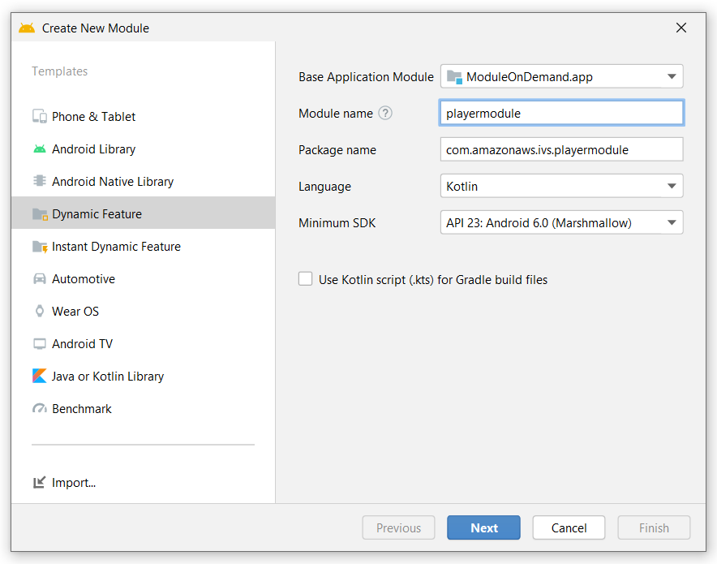

# Amazon IVS On-demand Android demo

This code sample shows how you can leverage [Play Feature Delivery](https://developer.android.com/guide/playcore/feature-delivery) to enable on-demand delivery of the Amazon IVS Player SDK, which will be downloaded from the Google Play Store when requested.

This is achieved by releasing your Android application with [.aar](https://developer.android.com/guide/app-bundle) bundles. (Note: this cannot be done with an `.apk`)


## Setup Instructions
The setup is tailored for a project that uses the nav-graph navigation. Follow along for instructions.
If needed, please refer to the [Quick Start Guide](https://developer.android.com/guide/playcore/feature-delivery) provided by Google.

#### Step 1: Add a new Dynamic Module to your project
Click on File -> New -> New Module...



Select Dynamic Feature and enter all the values necessary.


Pick the desired feature type - in our case we use on-demand delivery.

#### Step 2: Create or update you Application class
The class must extend `SplitCompatApplication` - don't forget to add it as `name` in your `application` tag in the`AndroidManifest.xml` file.
Override the `attachBaseContext(..)` function of the application and call `SplitCompat.install(this)`.

#### Step 3: Install the split module in every activity that needs access to the feature module
If you wish to use the feature module after it's downloaded you must call `SplitCompat.installActivity(this)` in every activity that needs access to it. If you plan to use the module in an fragment, you must install it in the parent activity of the fragment.

#### Step 4: Add the play core and navigation feature-delivery dependency
Add the following:
```
api "androidx.navigation:navigation-dynamic-features-fragment:2.3.5"
implementation "com.google.android.play:core:1.10.0"
```
to your main gradle file to enable feature module loading when using the `navigate(..)` function to switch between fragments.

#### Step 5: Update your navigation host to use DynamicNavHostFragment
In your activity layout file change the navigation host `name` to: 
```
android:name="androidx.navigation.dynamicfeatures.fragment.DynamicNavHostFragment"
```

#### Step 6: Listen for the feature download or add a custom AbstractProgressFragment
There are two ways to handle the feature download, either use the `InstallManager` to observe the feature download or create a fragment that extends the `AbstractProgressFragment` and implement the 3 callbacks to listener for the download state.

Both appoaches have known issues: 
- The manual install way described [here](https://developer.android.com/guide/navigation/navigation-dynamic#monitor) has a bug with the `installMonitor.isInstallRequired` boolean. It will always return `true` even if you have the `feature` installed. This means that when you use the `navigate(id, null, null, DynamicExtras(installMonitor)` as described there and then use it again when the `installation` is completed - you'll have your fragment opened twice.
- The custom progress fragment has a bug with the `onProgress` callback - it doesn't return values smoothly, so it'll jump from 1%-2% to 100%.

The demo app in this repository uses the custom progress fragment. The fragment is launched automatically when navigating to a fragment that is inside a feature module. 
To enable the progress fragment - set it as value in your `nav_graph` like so:
```
app:progressDestination="@id/loading_fragment"
```

When using the custom progress fragment you don't have to worry about download / install states as it will be handled automatically.  If the fragment is loaded or already pre-loaded, it will be opened. 

#### Step 7: Test your app
To test how the feature delivery works either upload your app to the Google Play Store, or use the [bundletool](https://developer.android.com/guide/playcore/feature-delivery/on-demand#local-testing) to simulate the experience.

---

## Amazon IVS Documentation
* [Amazon IVS Amazon Interactive Video Service](https://aws.amazon.com/ivs/) is a managed live streaming solution that is quick and easy to set up, and ideal for creating interactive video experiences. Simply send your live streams to Amazon IVS and the service does everything you need to make ultra-low latency live video available to any viewer around the world, letting you focus on building interactive experiences alongside the live video. [Learn more](https://aws.amazon.com/ivs/).
* [Amazon IVS Player SDK for Android](https://docs.aws.amazon.com/ivs/latest/userguide/player-android.html)
* [Amazon IVS docs](https://docs.aws.amazon.com/ivs/)
* [User Guide](https://docs.aws.amazon.com/ivs/latest/userguide/)
* [API Reference](https://docs.aws.amazon.com/ivs/latest/APIReference/)
* [Learn more about Amazon IVS on IVS.rocks](https://ivs.rocks/)
* [View more demos like this](https://ivs.rocks/examples)

## License
This sample code is made available under a modified MIT license. See the LICENSE file.
